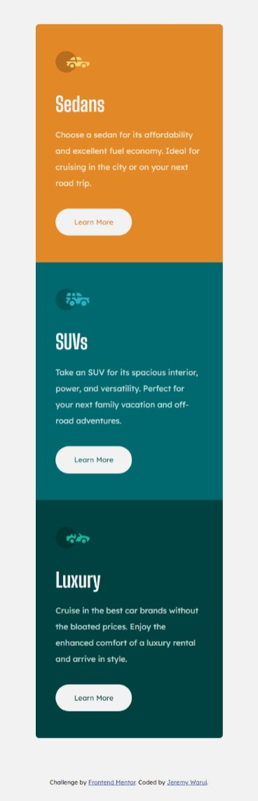
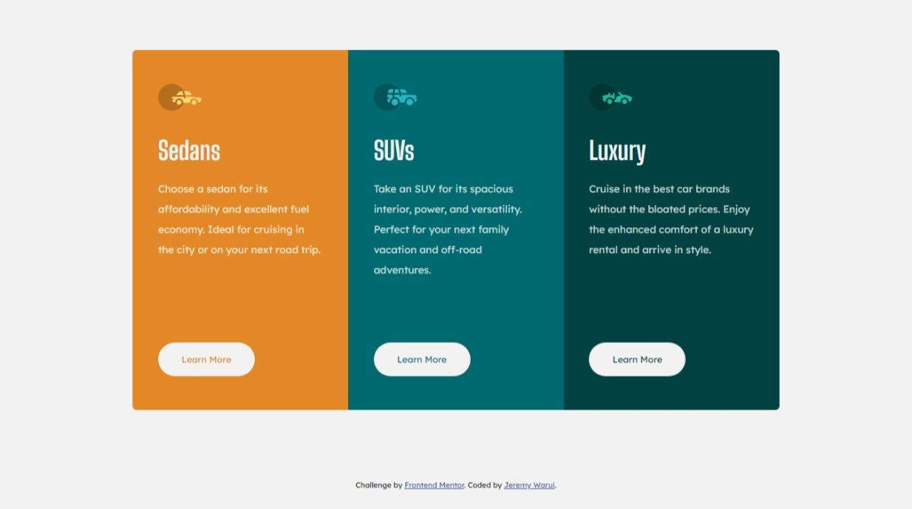

# Frontend Mentor - 3-column preview card component solution

This is a solution to the [3-column preview card component challenge on Frontend Mentor](https://www.frontendmentor.io/challenges/3column-preview-card-component-pH92eAR2-). Frontend Mentor challenges help you improve my coding skills by building realistic projects.

## Table of contents

- [Overview](#overview)
  - [The challenge](#the-challenge)
  - [Screenshot](#screenshot)
  - [Links](#links)
- [My process](#my-process)
  - [Built with](#built-with)
  - [What I learned](#what-i-learned)
  - [Continued development](#continued-development)
- [Author](#author)

## Overview

### The challenge

Users should be able to:

- View the optimal layout depending on their device's screen size
- See hover states for interactive elements

### Screenshot




### Links

- Solution URL: [Solution](https://jeremywarui.github.io/Cards-Challenge)
- Live Site URL: [Live Site](https://your-live-site-url.com)

## My process

### Built with

- Semantic HTML5 markup
- CSS custom properties
- CSS Grid
- Mobile-first workflow

### What I learned

Using mobile first approach make the work easy.
I am proud of his code makes the card group responsive:

```css
.card-group {
  max-width: 80vw;
  display: grid;
  grid: 1fr / repeat(3, 1fr);
}
```


### Continued development

I want to focus more on the cs grids t improve on layouts of the pages.

## Author

- Frontend Mentor - [@JeremyWarui](https://www.frontendmentor.io/profile/JeremyWarui)
